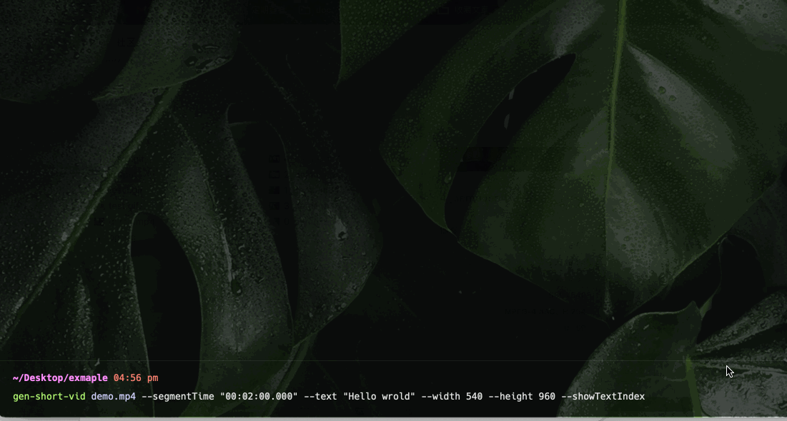

# gen-short-vid

`gen-short-vid`是一个基于 `ffmpeg` 开发的便捷工具，用于从长视频中生成短视频。


## Install

```bash
npm i -g gen-short-vid
```

## Usage

```bash
$ gen-short-vid --help

Usage:
  $ gen-short-vid <videoPath>

Commands:
  <videoPath>  源视频

For more info, run any command with the `--help` flag:
  $ gen-short-vid --help

Options:
  -o, --outputPath <dir>             输出的目录 eg: -o output_dir (default: output)
  --width <width>                    输出的视频的宽 eg: --width 1080
  --height <height>                  输出的视频的高 eg: --height 1920
  --text <text>                      添加视频标题文本 eg: --text "Hello world!"
  --fontSize <fontSize>              视频标题文本字体大小 eg: --fontSize 32
  --showTextIndex                    视频标题文本添加索引号 eg: --showTextIndex
  --textColor <textColor>            视频标题文本色 eg: --textColor "#f49857"
  --textBgColor <textBgColor>        视频标题文本背景色 eg: --textBgColor "#f49857"
  --padColor <padColor>              宽高超出视频填充的背景色 eg: --padColor "#f49857"
  --segmentTime <segmentTime>        视频片段时间, 按指定时间长度分片成多个视频 eg: --segmentTime "00:02:00.000"
  --bgImg <bgImg>                    添加视频背景图(输出的视频尺寸以背景图为准，不能和width、height一起使用) eg: --bgImg "./bg.jpg"
  --splitStartTime <splitStartTime>  分割视频的开始时间 eg: --splitStartTime "00:02:00.000"
  --splitEndTime <splitEndTime>      分割视频的结束时间 eg: --splitEndTime "00:04:00.000"
  -h, --help                         Display this message
  -v, --version                      Display version number

```

## 功能

- 分割视频
  - `--splitStartTime  "00:02:00.000"`分割的开始时间
  - `--splitEndTime "00:04:00.000" `分割的结束时间
- 自定义视频的尺寸，等比例调整尺寸，多余部分使用`padColor`颜色填充
  - `--width 1080`设置视频的宽度
  - `--height 1920`设置视频的高度
  - `--padColor #000000` 设置视频填充的背景色
- 添加视频的标题文本
  - `--text "Hello, world"` 设置文本内容
  - `--textColor "#ffffff"` 设置文本颜色
  - `--textBgColor "#000000"` 设置文本行的背景色
  - `--showTextIndex` 如果切片视频可给标题添加顺序索引
  - `--fontSize 32` 默认自动根据视频尺寸设置字体大小，可自行设置字体大小
- 切片视频: 将长视频按切片时间的长度 切出多个短视频
  - `--segmentTime "00:02:00.000"` 如果十分钟的视频则按两分钟切出五个短视频
- 添加视频背景图 ⚠️如果设置视频背景图 视频的尺寸则按背景图的尺寸输出，所以不能再设置宽高
  - `--bgImg ./bg.jpg`

```bash
gen-short-vid/0.0.5

Usage:
  $ gen-short-vid <videoPath>

Commands:
  <videoPath>  源视频

For more info, run any command with the `--help` flag:
  $ gen-short-vid --help

Options:
  -o, --outputPath <dir>             输出的目录 eg: -o output_dir (default: output)
  --width <width>                    输出的视频的宽 eg: --width 1080
  --height <height>                  输出的视频的高 eg: --height 1920
  --text <text>                      添加视频标题文本 eg: --text "Hello world!"
  --fontSize <fontSize>              视频标题文本字体大小 eg: --fontSize 32
  --showTextIndex                    视频标题文本添加索引号 eg: --showTextIndex
  --textColor <textColor>            视频标题文本色 eg: --textColor "#f49857"
  --textBgColor <textBgColor>        视频标题文本背景色 eg: --textBgColor "#f49857"
  --padColor <padColor>              宽高超出视频填充的背景色 eg: --padColor "#f49857"
  --segmentTime <segmentTime>        视频片段时间, 按指定时间长度分片成多个视频 eg: --segmentTime "00:02:00.000"
  --bgImg <bgImg>                    添加视频背景图(输出的视频尺寸以背景图为准，不能和width、height一起使用) eg: --bgImg "./bg.jpg"
  --splitStartTime <splitStartTime>  分割视频的开始时间 eg: --splitStartTime "00:02:00.000"
  --splitEndTime <splitEndTime>      分割视频的结束时间 eg: --splitEndTime "00:04:00.000"
  -h, --help                         Display this message
  -v, --version                      Display version number
```

## Example

源视频 demo.mp4

<video src="./docs/demo.mp4" width="300"></video>

### 自定义尺寸

```bash
gen-short-vid demo.mp4 \
  --segmentTime "00:02:00.000" \
  --text "Hello world" \
  --width 540 \
  --height 960 \
  --showTextIndex
```



输出的 0_demo.mp4 的结果

<video src="./docs/1/0_demo.mp4" width="300"></video>

### 使用背景图生成短视频

```bash
gen-short-vid demo.mp4 \
  --segmentTime "00:02:00.000" \
  --text "Hello world" \
  --bgImg bg.jpg \
  --showTextIndex
```

输出的 0_demo.mp4 的结果

<video src="./docs/2/0_demo.mp4" width="300"></video>

### 分割出某个时间段的视频

```bash
gen-short-vid demo.mp4  --splitStartTime "00:04:00.000" --splitEndTime "00:08:00.000"
```

输出的 0_demo.mp4 的结果
